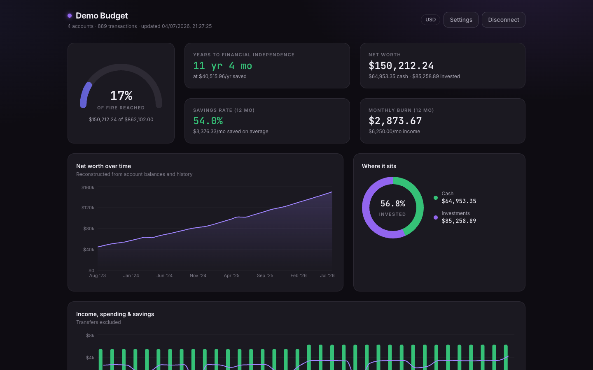

# Actual · Financial Analysis

A **demo app** showing how to use [`@actual-app/api`](https://www.npmjs.com/package/@actual-app/api)
**directly in the browser** — no backend of your own. It loads an [Actual Budget](https://actualbudget.org)
file client-side and renders a read-only analysis dashboard from it.

> ⚠️ **Disclaimer — demo/example only.** This is a reference app built to
> demonstrate browser usage of `@actual-app/api` (which Actual currently labels
> experimental). It is **not production-ready** and is not intended for production
> use — treat it as an example to learn from, not a maintained product.



## The interesting part: `@actual-app/api` in the browser

All the package usage lives in [`src/snapshot/actual-browser.ts`](src/snapshot/actual-browser.ts).
It uses the **browser build** of `@actual-app/api`, which downloads your encrypted
budget, decrypts it locally, and opens it as a SQLite database compiled to
WebAssembly (persisted via IndexedDB). The key calls:

- `api.init(...)` — boot the WASM engine
- `api.downloadBudget(...)` — fetch and decrypt the budget from a sync server
- `api.importBudget(...)` — or load an Actual export (.zip) with no server at all
- `api.getAccounts()` / `api.getTransactions(...)` / `api.getPreferences()` — read the data

Everything runs client-side; the app only ever calls **read** APIs and never
modifies your budget.

> **Note:** the browser build uses `SharedArrayBuffer`, so the page must be
> [cross-origin isolated](https://web.dev/articles/coop-coep) — served over HTTPS
> with `Cross-Origin-Opener-Policy: same-origin` and
> `Cross-Origin-Embedder-Policy: require-corp`. The dev server sets these for you.

## Run it

```bash
corepack enable   # once, to activate Yarn 4 via Corepack
yarn install
yarn dev
```

Open the printed Vite URL (default http://localhost:5173) and click
**Try the demo** to explore the dashboard with synthetic sample data — no account
needed. To use real data, fill in your **Server URL**, **Password**, **Sync ID**,
and (if encrypted) **Encryption key** instead.

```bash
yarn build   # produces a static site in dist/ (must be served cross-origin isolated)
```

## Development

```bash
yarn test        # analysis + render tests (Vitest)
yarn typecheck
```

The financial math lives in `src/analysis/` as pure, unit-tested functions; the
UI in `src/components/`.
